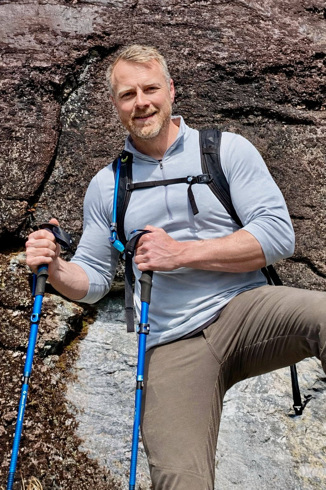

::: {.hero}
::: {.hero-content}
**Solutions Architecture • Applied AI • Federal Program Leadership**

Air Force enlisted to GS-14 federal program leader, with a habit of setting a goal, doing the work, and shipping the result.
:::
:::

::: {.container}

## Real-World Experience

I bring 20+ years in the federal sector, from enlisted Air Force service to senior program leadership at the FDA, and a pattern of finishing what I start: degrees earned while working full-time, complex federal programs delivered, and production software designed, built, and shipped on my own initiative.

### Background Summary
- **Military Foundation** - U.S. Air Force veteran who understands discipline, service, and mission-critical system reliability
- **Federal Program Leadership** - GS-14 program manager and COR III at the FDA, leading modernization initiatives that serve 400+ regulatory scientists
- **Product Leadership** - Translating ambiguous business problems into clear product strategies, roadmaps, and measurable outcomes. Certified Scrum Product Owner (scrum.org)
- **Builder** - Ships real AWS systems in production (not just cert prep) and iOS apps on the App Store; see [Projects](/projects/) for details
- **Applied AI** - Designed and delivered an AI-assisted review workflow inside the FDA firewall — LLM recommendations with supporting evidence, human reviewers with final authority
- **Cloud Architecture** - Pursuing AWS Solutions Architect – Associate certification (SAA-C03) on the same services I run in production

{.img-fluid .rounded-xl .shadow-lg}

## Core Strengths

::: {.app-showcase}
::: {.app-card}

<i class="bi bi-shield-fill-check"></i>

### Military Service
U.S. Air Force veteran who learned the value of discipline, teamwork, and getting the mission done right the first time.
:::

::: {.app-card}

<i class="bi bi-graph-up"></i>

### Federal Program Delivery
Led modernization at FDA scale, with COR III authority to oversee contractor performance and hold vendors accountable. The programs I manage serve the scientists who regulate tobacco products for the entire U.S. market.
:::

::: {.app-card}

<i class="bi bi-lightbulb"></i>

### System Architecture
Computer Science and MBA graduate who designs real cloud systems: a production serverless architecture on AWS, built and deployed with CDK.
:::

::: {.app-card}

<i class="bi bi-people"></i>

### Technology Leadership
Hands-on builder who stays technically credible: AWS, TypeScript, and CDK in personal projects. I treat AI as a tool I direct — I design the workflow, set the guardrails, and keep a human on the final call.
:::
:::

## Philosophy & Approach

### What Drives Me
- **Close the gap**: Government technology is consistently a decade behind where it should be. I've spent 20 years on that problem from the inside and I'm not done.
- **Credible at the whiteboard**: A PM who can't follow the architecture discussion is a bottleneck. I stay technical enough to be useful, not just present.
- **Ship, then improve**: A deployed imperfect system beats a perfect plan still in review. I've seen both and know which one moves the mission.
- **Build for whoever comes next**: Federal programs outlast their PMs. Decisions I make today will be maintained by people who weren't in the room. I design with that in mind.

::: {.card}
*"Great architecture isn't about using the latest technology; it's about building systems that are reliable, scalable, and maintainable for the long term."*
:::

## The Path Here

### **Humble Beginnings**
Started with paper routes and McDonald's, learning that every job teaches you something valuable about work ethic and problem-solving.

### **Military Service**
U.S. Air Force service taught discipline, attention to detail, and how to work under pressure with mission-critical systems.

### **Education & Growth**
Earned degrees in Computer Science and MBA while working full-time, proving that learning never stops and skills build on each other.

### **Federal Leadership**
Reached GS-14 and earned COR III certification at the FDA, managing programs with real contractor accountability. Led product strategy for modernization systems that serve the scientists who regulate tobacco products for the entire U.S. market.

### **Modern Architecture**
Set out to build a real cloud product and shipped [PetShots](https://petshots.app), a serverless AWS platform running in production, along with iOS apps on the App Store.

### **Applied AI**
Designed and delivered an AI-assisted review workflow for an FDA regulatory tracking system: an in-firewall LLM analyzes each project abstract against the coding manual and returns recommendations with supporting evidence snippets and discrepancy flags. Reviewers keep final authority — the AI narrows the discussion to the disagreements instead of replacing it. The same discipline runs through my own projects: AI coding agents build to my architecture on PetShots, and a computer-vision stair counter is in progress.

## Beyond the Code

### **Outdoor Enthusiast**
Active hiker who tackles steep climbs and overnighters. Mountain biking and skateboarding keep things interesting. My partially built-out van sees weekend vanlifer adventures.

### **Trail Buddy**
Ollie, my Golden Retriever, is my constant companion on trails and road trips. He's got better trail instincts than most humans I know.

### **Lifelong Learner**
Fascinated by how systems, organizational or technical, succeed or fail. Always looking for the more efficient path.

## Current Focus

::: {.card .card-featured .mb-8}
### Proving It, Not Claiming It

I'd rather show working systems than list buzzwords. Right now that means:

- **AWS SAA-C03**: Certification in progress, studying services I already run in production, not a sandbox, not simulated
- **Production AWS**: A live serverless architecture (CloudFront, Cognito, API Gateway, Lambda, S3, EventBridge, SES) I designed with CDK. [See the details →](/projects/)
- **Applied AI**: A human-in-the-loop LLM review workflow delivered inside the FDA firewall, plus a computer-vision app in progress that counts the stairs in any photo
- **Federal Modernization**: Leading FDA product strategy that serves 400+ regulatory scientists
- **Writing**: [Newsletter](https://newsletter.markgingrass.com) on federal IT and GovTech
:::

:::

