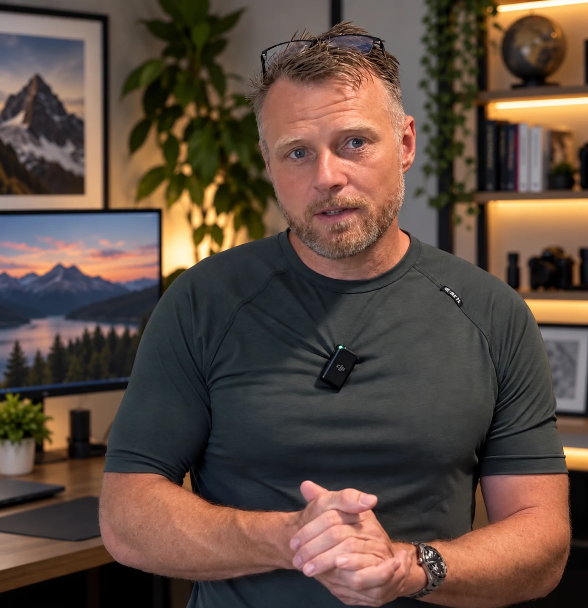

::: {.hero}
::: {.hero-content}
**Solutions Architecture • Applied AI • Federal Program Leadership**

I architect and ship real systems: a live serverless platform on AWS, an AI-assisted review workflow inside the FDA firewall, and apps on the App Store.

[See Projects](/projects/){.btn .btn-primary} [About Me](/about.html){.btn .btn-secondary}

:::
:::

::: {.container}

## Professional

GS-14 Program Manager at the FDA with a Computer Science background I've kept sharp by shipping real systems. Twenty-plus years in federal technology, from enlisted Air Force service through senior program leadership, gives me something most cloud candidates don't have: I understand how agencies actually buy, approve, and operate technology. I know what a COR does, what an ATO means in practice, and how to move a program through procurement without it dying in review.

Now I'm moving that background into Solutions Architect and senior TPM roles in GovTech and defense tech, where the combination is rare: federal domain depth, hands-on cloud work, and a track record of finishing what I start.

I translate between the people who fund systems and the people who build them. I can read an architecture diagram, push back on a vendor proposal, and write a user story for the same system in the same week. And when a problem calls for AI, I design the workflow around it — including who checks the output — rather than bolting a chatbot onto the org chart.

### Current Focus

* Leading product strategy for FDA modernization initiatives that serve 400+ regulatory scientists
* Delivered an AI-assisted review workflow for an FDA regulatory tracking system: an in-firewall LLM analyzes each project abstract against the coding manual and returns recommendations with supporting evidence and discrepancy flags — the review team keeps final authority
* Pursuing the AWS SAA-C03 certification with production architecture as the hands-on lab, not a sandbox. [See what that means](/projects/)

{.img-fluid .rounded-xl .shadow-lg}

## Outdoor Enthusiast

I have been hiking for several years now, lately focused on overnight trips and more grueling terrain. I also dabble with mountain biking, running, fitness, and skateboarding.

I make annual trips to the Upper Gauley in West Virginia for Class 5 whitewater, have completed a solo skydive, and volunteer regularly to plant trees and clean up trails.

My dog Ollie joins me on trails and camping whenever possible.

## Curious Mind

Interested in how systems, organizational and technical, succeed or fail. Lean, Six Sigma, and process improvement aren't abstract to me; I've applied them in environments where inefficiency has real regulatory consequences.

Always looking for the more efficient path, and usually finding it.

## AI, In Practice

- **Human-in-the-loop AI**: Designed an LLM review workflow now running inside the FDA firewall — recommendations with evidence, humans with authority
- **AI-assisted engineering**: I direct AI coding agents across [PetShots](https://petshots.app) and my iOS work; the architecture decisions stay mine
- **Computer vision**: Building an app that counts the stairs in any photo — screenshot a stair set, get the number
- **AWS Solutions Architect Associate**: Working toward certification on the same services I already run in production

## Recent Newsletter Posts

Loading posts…

:::

